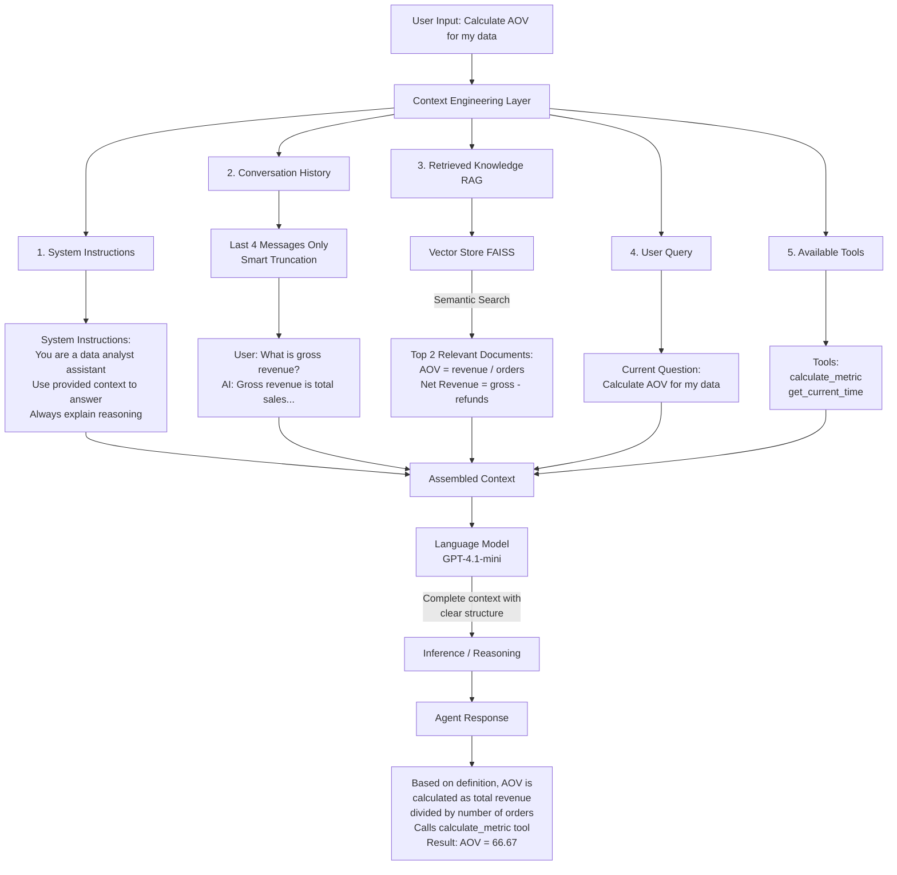

# Context Engineering Visualizer

A visual demonstration of **context engineering** principles in LLM-based agents. This project shows how information flows into an agent's context window before inference, making the abstract concept of "context engineering" concrete and understandable.

## What is Context Engineering?

**Context engineering** is the practice of deliberately deciding:

- **What information** an AI model sees
- **When** it sees it
- **In what format** it's presented

Unlike prompt engineering (which focuses on *how you ask*), context engineering shapes *what the model understands*.

## Features

This visualizer demonstrates the **5 key context layers**:

1. 🎯 **System Instructions** - Stable behavioral guidelines
2. 💬 **Conversation History** - Short-term memory with smart truncation
3. 📚 **Retrieved Knowledge (RAG)** - Relevant documents from vector store
4. 📝 **User Query** - Current user intent
5. 🔧 **Available Tools** - External capabilities the agent can use

## Project Structure

```
context-engineering-visualizer/
├── main.py              # Main application with agent and visualizer
├── pyproject.toml       # Dependencies (uv package manager)
├── README.md           # This file
└── .env                # Your OpenAI API key (create from .env.example)
```

## Installation

### 1. Clone & Setup

```bash
# Make sure you have Python 3.12+ installed
python --version

# Install uv if you haven't (fast Python package manager)
pip install uv
```

### 2. Install Dependencies

```bash
# Using uv (recommended)
uv sync

# Or using pip
pip install -e .
```

### 3. Set Up API Key

Create a `.env` file in the project root:

```bash
OPENAI_API_KEY=your-api-key-here
```

Get your API key from: https://platform.openai.com/api-keys

## Usage

### Demo Mode (Recommended First)

Run pre-built scenarios to see context engineering in action:

```bash
python main.py
```

This will walk you through 3 scenarios:

1. RAG-based query
2. Query requiring tool use
3. Query using conversation context

### Interactive Mode

Chat with the agent and see real-time context visualization:

```bash
python main.py interactive
```

### Example Queries to Try for the interactive mode

**Basic Knowledge Questions:**

- "What is Net Revenue?"
- "What is Average Order Value?"
- "Explain Customer Lifetime Value"
- "What's the difference between gross and net revenue?"
- "What is churn rate?"

**Tool Usage (Calculations):**

- "Calculate AOV if revenue is $100000 and orders are 2000"
- "Calculate conversion rate with 500 conversions from 10000 visitors"
- "Calculate churn rate if 50 out of 1000 customers left"
- "What time is it?"

**Using Conversation Context:**

- Ask: "What is AOV?"
- Then: "Can you calculate it for $50000 revenue and 500 orders?"
- Then: "What about with 750 orders?" ← *Uses previous context!*

**Complex Queries:**

- "I have $80000 in revenue from 1200 orders. What's my AOV and is it good?"
- "Calculate churn rate if 120 out of 2400 customers left, and explain what it means"

## What Makes This "Context Engineering"?

### NOT Just Prompt Engineering

```python
# Prompt engineering
prompt = "Calculate AOV using this formula..."

# Context engineering
context = {
    system: "You are a data analyst...",
    history: [last_4_messages],
    knowledge: retrieve_relevant(query),
    query: user_question,
    tools: [calculate_metric, get_time]
}
```

### The Key Difference

| Aspect             | Prompt Engineering | Context Engineering       |
| ------------------ | ------------------ | ------------------------- |
| **Focus**    | Wording            | Information flow          |
| **Scope**    | Single message     | Entire system             |
| **Strategy** | Optimize phrasing  | Optimize context assembly |
| **Tools**    | Text tricks        | RAG, memory, tools        |

## How It Works

### Context Engineering Principles Demonstrated

#### 1. **Relevance**

- Only retrieves top 2 most relevant documents (not entire knowledge base)
- Keeps only last 4 conversation messages (prevents context bloat)
- Each layer serves a specific purpose

#### 2. **Structure**

- Clear separation between system instructions and data
- Structured format: Context → History → Query
- Models perform better with organized information

#### 3. **Timing**

- Knowledge retrieved *after* user query (not preloaded)
- History summarized *before* sending to model
- Tools called only when needed

#### 4. **Consistency**

- Stable system prompt across all interactions
- Low temperature (0) for predictable behavior
- Reusable context assembly pattern

### Common Patterns You'll Notice

**Pattern 1: Relevance Filtering**

- Doesn't send all 8 knowledge documents
- Only sends top 2 relevant ones
- Saves tokens, improves focus

**Pattern 2: Smart Truncation**

- Conversation history limited to 4 messages
- Keeps recent context
- Prevents token overflow

**Pattern 3: Layer Separation**

- Instructions ≠ Data ≠ Query
- Clear boundaries help model
- Structured input → better output

**Pattern 4: Dynamic Retrieval**

- Knowledge fetched per-query
- Not pre-loaded
- Timing matters

### Understanding the Context Layers

**1. System Instructions (Stable)**

- Same every time
- Defines agent behavior
- Sets output style

**2. Conversation History (Dynamic)**

- Last 4 messages only
- Prevents context bloat
- Enables follow-up questions

**3. Retrieved Knowledge (Relevant)**

- Top N similar documents
- Retrieved via semantic search
- Based on current query

**4. User Query (Current)**

- Your actual question
- Fresh every time

**5. Available Tools (Capabilities)**

- Functions agent can call
- Descriptions help model decide
- Executed when needed

### Visualization Output

Each query shows:

```
================================================================================
CONTEXT WINDOW VISUALIZATION
================================================================================

1. SYSTEM INSTRUCTIONS
   Tokens: 45 (15.2%)
   [███████                                           ]
   Content:
   You are a data analyst assistant...

2. CONVERSATION HISTORY
   Tokens: 67 (22.6%)
   [███████████                                       ]
   Content:
   User: What is AOV?...

3. RETRIEVED KNOWLEDGE (RAG)
   Tokens: 89 (30.1%)
   [███████████████                                   ]
   Content:
   - AOV (Average Order Value) is calculated...

4. USER QUERY
   Tokens: 32 (10.8%)
   [█████                                             ]
   Content:
   Calculate AOV if revenue is $50000...

5. AVAILABLE TOOLS
   Tokens: 63 (21.3%)
   [██████████                                        ]
   Content:
   - calculate_metric: Calculate a business metric...

================================================================================
TOTAL CONTEXT TOKENS: 296
================================================================================
```

**Understanding the Token Bar:**

```
[███████████████                                   ]
```

- Shows percentage of total context
- Longer bar = more tokens
- Helps visualize context budget

## Architecture & Information Flow

### Context Engineering Flow



### Context Engineering Principles

**1. Relevance (What to Include)**

```
❌ BAD: Dump entire knowledge base (1000+ docs, 10,000 tokens)
✅ GOOD: Retrieve top-2 most relevant docs (200 tokens)

Token Savings: 10,000 → 200 tokens (50x reduction!)
```

**2. Structure (How to Organize)**

```
❌ BAD: "You are helpful. User said X. Documents say Y. Calculate Z."
✅ GOOD: Clear layers with separation:
         System Instructions: [...]
         Conversation History: [...]
         Retrieved Knowledge: [...]
         Current Query: [...]
```

**3. Timing (When to Retrieve)**

```
Timeline:
1. User asks question
2. Retrieve relevant knowledge (not before!)
3. Fetch conversation history
4. Assemble context
5. Send to model

⚠️ Don't pre-load all possible context!
```

**4. Consistency (Stable Patterns)**

```
✓ Same system prompt every time → predictable behavior
✓ Low temperature (0) → consistent responses
✓ Fixed context structure → reliable reasoning
```

### Token Efficiency Comparison

| Approach                           | Total Tokens | Breakdown                                                                                       | Cost per Query | Performance                    |
| ---------------------------------- | ------------ | ----------------------------------------------------------------------------------------------- | -------------- | ------------------------------ |
| **Bad Context Engineering**  | 15,000       | All docs: 12,000``Full history: 2,000``System+Query: 1,000                        | $0.15          | Model struggles with noise     |
| **Good Context Engineering** | 500          | System: 50``Last 4 msgs: 150``Top-2 docs: 200``Query: 50``Tools: 50 | $0.005         | Model focuses, performs better |

**Result: 30x cheaper + better performance!**

## Code Highlights

### Agent Architecture

```python
class ContextEngineeringAgent:
    def __init__(self):
        self.llm = ChatOpenAI(model="gpt-4.1-mini", temperature=0)
        self.knowledge_base = KnowledgeBase()  # RAG component
        self.memory = ConversationMemory()      # History management
        self.visualizer = ContextVisualizer()   # Visualization
        self.agent = create_agent(
            model=self.llm,
            tools=[calculate_metric, get_current_time],
            system_prompt=self.system_prompt
        )
```

### Context Assembly

The key insight is **explicit context construction** before inference:

```python
context_message = f"""Context from Knowledge Base:
{retrieved_context}

Previous Conversation:
{history_text}

Current Question:
{user_query}"""

result = self.agent.invoke({
    "messages": [{"role": "user", "content": context_message}]
})
```

## Technologies Used

- **LangChain** - Agent framework
- **OpenAI GPT-4.1-mini** - Language model
- **FAISS** - Vector store for RAG
- **OpenAI Embeddings** - Text embeddings
- **Python 3.12+** - Programming language

## Common Context Engineering Mistakes (That This Avoids)

❌ **Dumping entire documents** → ✅ Retrieve only top-k relevant chunks
❌ **Sending full chat history** → ✅ Smart truncation to recent messages
❌ **Mixing instructions with data** → ✅ Clear layer separation
❌ **No token awareness** → ✅ Token estimation and visualization
❌ **Static context** → ✅ Dynamic retrieval based on query

## Troubleshooting

### "ModuleNotFoundError"

```bash
# Install dependencies
uv sync
# or
pip install -e .
```

### "OpenAI API Error"

- Check `.env` file exists
- Verify API key is correct
- Ensure key starts with `sk-`

### "RateLimitError"

- You've hit OpenAI rate limit
- Wait a moment and try again
- Consider upgrading OpenAI plan

### No output shown

- Check API key has credits
- Verify internet connection
- Look for error messages

## Tips for Best Results

### Writing Good Queries

✅ "Calculate AOV for $50000 revenue and 500 orders"
❌ "do the aov thing"

✅ "What's the difference between gross and net revenue?"
❌ "revenue?"

### Follow-up Questions

After asking about a metric:

- "Can you calculate it for my data?"
- "What about with different numbers?"
- "Compare that to industry average"

### Observing Context Flow

Watch how:

- RAG retrieves different docs per query
- History accumulates over conversation
- Tools get called when numbers are involved
- Token distribution changes

## Key Insights

1. **Context is multi-layered** - Not just your prompt
2. **Less is often more** - Relevant beats comprehensive
3. **Structure matters** - Organization helps models
4. **Dynamic beats static** - Assemble per-query
5. **Tokens cost money** - Engineering saves budget

## Next Steps

Want to extend this project?

- Add token cost tracking ($ per query)
- Implement context compression techniques
- Add more sophisticated memory (summarization)
- Create a web UI with real-time visualization
- Compare context strategies (with/without RAG, different window sizes)

## Contributing

This is a learning/demo project. Feel free to fork and adapt for your own articles or projects!
